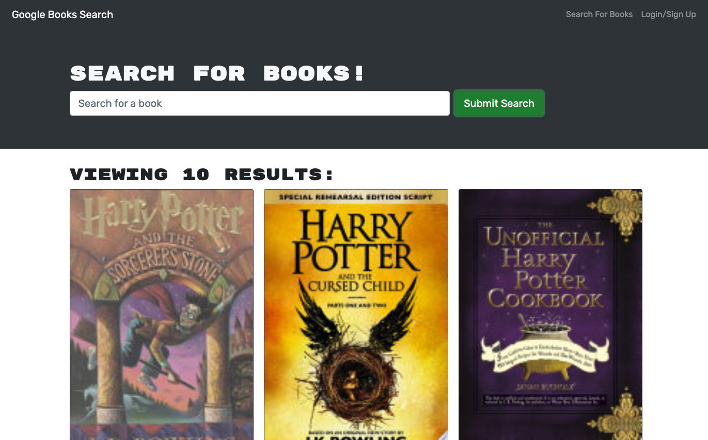

# book-serach-engine

## Description
As an avid reader I want to search for new books to read so that I can keep a list of books to purchase.
## Table of Contents
- [Installation](#installation)
- [Usage](#usage)
- [License](#license)
- [Contributing](#contributing)
- [Questions](#questions)
## Installation
To install necessary dependencies, run the following command:
```
npm i
npm i graphql
npm run develop
```

## Usage
Apollo Client, GraphQl, JWT, React, Apollo-Server-Express, Bcrypt, Express, Mongoose, and jsonWebToken are all required to run this application.

A linked to my deployed page can be found here: [Heroku](https://still-thicket-10545.herokuapp.com/).




## License
This project is licensed under the: none.


## Contributing
There were no additional contributors to this project.

## Questions
If you have any questions about the repo, open an issue or contact me directly at boppcaitlin@gmail.com. You can find more of my work at [caitbopp](https://github.com/caitbopp).